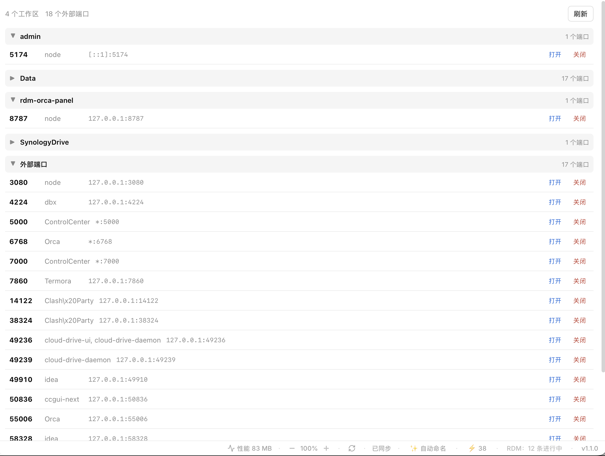

# 端口管理 / Port Manager

[](LICENSE)
[](https://github.com/hekai753/port-manager/releases)

**CC GUI 插件**：按工作区分组展示本机监听中的 TCP 端口，一键打开浏览器、一键关闭端口。

**A CC GUI plugin** that lists local listening TCP ports grouped by workspace, with one-click "open in browser" and "close port".



## ✨ 功能 / Features

- ⚡ **状态栏计数**：实时显示监听中的端口总数，点击直达端口页签，5 秒自动刷新
- 📁 **按工作区分组（自动识别）**：以进程 cwd 为起点，用 `git rev-parse --show-toplevel` 反查所属 git 仓库的顶层目录作为工作区——子目录里启动的 dev server（如 `AgentDemo/act-assistant/admin`）会自动归到 `AgentDemo` 组；非 git 目录按 cwd 目录名分组；无法定位 cwd 的归入「外部端口」，cwd 为 `/` 的系统进程同样视为外部。识别结果按路径缓存，仅新目录触发一次 git 调用
- 🗂️ **分组折叠**：点击分组头折叠/展开，折叠状态持久化，重启后保持
- 🔗 **打开浏览器**：每个端口一键打开 `http://localhost:<port>`
- 🛑 **关闭端口**：结束监听进程即可释放端口；两段式确认（3 秒内再点一次）防误杀
- 🌍 **跨平台**：自动适配 macOS / Linux / Windows
- 🈶 **双语界面**：中文 / English，跟随宿主语言

### 平台适配细节 / Platform details

| 能力 | macOS | Linux | Windows |
|---|---|---|---|
| 列端口 | `lsof -nP -iTCP -sTCP:LISTEN` | 同左；缺失 lsof 时回落 `ss -tlnp` | `netstat -ano` + `tasklist` |
| 分组依据 | cwd → git 仓库顶层（自动识别工作区），非 git 目录按 cwd 目录名 | 有 lsof → 同左；无 → 进程名 | 进程名（自动去 `.exe`） |
| 打开浏览器 | `open <url>` | `xdg-open <url>` | `cmd /c start "" <url>` |
| 关闭端口 | `kill -TERM <pid…>` | 同左 | `taskkill /T /F /PID …` |

> Linux 下若无 lsof，回落 `ss` 后只能按进程名分组；部分进程无权限读取 PID 时该端口无法关闭（不显示关闭按钮）。

## 🔐 权限说明 / Permissions

本插件**不发起任何网络请求**，所有数据均来自本机命令输出，仅在本地解析渲染。

This plugin makes **no network requests**. All data comes from local command output and is parsed and rendered locally.

| 权限 | 用途 / Purpose |
|---|---|
| `ui:center-tab` `ui:status-bar` `ui:command` | 端口页签、状态栏计数 chip、命令面板入口 |
| `storage` | 持久化分组折叠状态（键 `collapsed`，仅存组名 → 布尔值） |
| `exec:uname` | 探测操作系统平台 |
| `exec:lsof` `exec:ss` | 列出监听端口与进程 cwd（macOS / Linux） |
| `exec:git` | 从进程 cwd 反查所属 git 仓库顶层目录（工作区自动识别，只读操作） |
| `exec:netstat` `exec:tasklist` | 列出监听端口与进程名（Windows） |
| `exec:open` `exec:xdg-open` `exec:cmd` | 调用系统默认浏览器打开 localhost 地址 |
| `exec:kill` `exec:taskkill` | 结束所选端口的监听进程 |

**数据去向 / Data flow**：命令输出仅在插件内存中解析展示；唯一持久化数据是分组折叠状态（经 `ctx.storage`）。无遥测、无上报、无文件读写。
All command output stays in memory; the only persisted data is the collapsed-group state. No telemetry, no uploads.

## 📦 安装 / Install

**市场安装 / Marketplace**：CC GUI → 插件 → 搜索「端口管理」或 "Port Manager"。

**本地安装 / Local**：CC GUI → 插件 → 从本地目录安装 → 选择本仓库根目录（含 `manifest.json`）。

## ❓ FAQ

- **Q：为什么有些端口显示在「外部端口」？**
  A：插件的进程工作目录无法读取（权限不足），或 cwd 为 `/`（系统守护进程）。功能不受影响，照常可以打开浏览器；无 PID 的行出于安全考虑不提供关闭按钮。

- **Q：点了「关闭」端口还在？**
  A：确认按钮有 3 秒防误杀窗口，需要再点一次「确认关闭」；进程若被守护进程自动拉起，端口会重新出现——这是进程管理问题而非插件问题。

- **Q：关闭按钮会杀掉我的数据吗？**
  A：`kill -TERM` 是优雅退出信号，进程有机会保存状态；Windows 走 `taskkill /T /F` 会连带子进程树强制结束，对 IDE 里调试中的进程请谨慎。

- **Q：为什么 Windows 下不按工作区分组？**
  A：Windows 原生命令（netstat/tasklist）拿不到进程 cwd，需要 Sysinternals `handle.exe` 等额外工具，插件坚持零依赖，故按进程名分组。

## 🛠️ 开发 / Development

纯单文件 ESM（`main.js`）：无第三方依赖、无构建步骤、无 `import`。

```bash
node --check main.js   # 语法校验
```

**发版 / Release**：改 `manifest.json` 的 `version` → 提交 → 打同名 tag（无 `v` 前缀）推送。GitHub Action 会校验 tag 与 version 一致，并把 `main.js` / `manifest.json` 附加到 Release。

```bash
git tag 0.2.1 && git push origin 0.2.1
```

## 📄 License

[MIT](LICENSE) © hekai753
